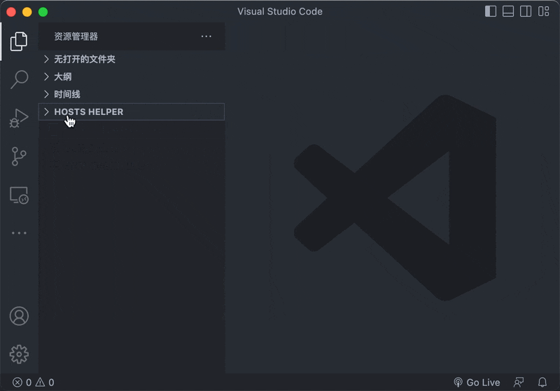

# Hosts Switch Helper

Visual Studio Code plug-in for switching system hosts files.
Install by searching for `lanyue.hosts-switch-helper` or [online](https://marketplace.visualstudio.com/items?itemName=lanyue.hosts-switch-helper).

> After installation, find it in the `Hosts Helper` tree view in the `explorer` panel.
> For easy viewing, you can also drag it to the `activitybar`.

## Development

- Run `pnpm install` in terminal to install dependencies
- Run the `Run Extension` target in the Debug View. This will:
  - Start a task `npm: watch` to compile the code
  - Run the extension in a new VS Code window
